```mermaid

%%{init: {'theme': 'base', 'themeVariables': { 'primaryColor': '#e9d5ff', 'primaryTextColor': '#1e293b', 'primaryBorderColor': '#c084fc', 'lineColor': '#94a3b8', 'secondaryColor': '#f1f5f9', 'tertiaryColor': '#e0e7ff', 'background': '#ffffff', 'mainBkg': '#ffffff', 'textColor': '#334155', 'nodeBorder': '#cbd5e1'}}}%%
flowchart LR
    subgraph UI["🎯 USER INTERFACE LAYER"]
        direction TB
        NL["💬 Natural Language Requests"]
    end

    subgraph ORCH["🧠 ORCHESTRATION LAYER"]
        direction TB
        IC["🔍 Intent Classification"]
        RT["🚦 Tool Routing"]
    end

    subgraph SERVICES["⚙️ CORE SERVICES"]
        direction TB
        KS["🏛️ kernel_server.py<br/>Port 8888 • 10KB"]
        JK["⚙️ jupyter_kernel.py<br/>PID 300-400 • 17KB"]
        BG["🛡️ browser_guard.py<br/>Port 9222/9223 • 41KB"]
        UT["🔧 utils.py<br/>1.2KB"]
    end

    subgraph SKILLS["📚 SKILL SYSTEM"]
        direction TB
        DOCX["📄 DOCX Skill<br/>Validator .NET • 73KB"]
        XLSX["📊 XLSX Skill<br/>KimiXlsx Binary • 77MB"]
        PDF["📕 PDF Skill<br/>Tectonic • 57MB"]
        WEB["🌐 WebApp Skill<br/>React Template"]
    end

    subgraph DATA["🌍 DATA SOURCES"]
        direction TB
        YF["💰 yahoo_finance"]
        WB["🏛️ world_bank"]
        AR["📚 arxiv"]
        GS["🎓 google_scholar"]
    end

    subgraph INFRA["🏗️ RUNTIME INFRASTRUCTURE"]
        direction TB
        CD["🗂️ chrome_data/<br/>Browser Profile (272 files)"]
        PV["👁️ pdf-viewer/<br/>Extension (387 files)"]
        WS["📁 /mnt/kimi/<br/>upload(RO) • output(RW)"]
    end

    UI --> ORCH
    ORCH --> SERVICES
    ORCH --> SKILLS
    ORCH --> DATA
    SERVICES --> INFRA
    SKILLS --> INFRA

    style UI fill:#e9d5ff,stroke:#c084fc,stroke-width:2px,color:#1e293b
    style ORCH fill:#fbcfe8,stroke:#f472b6,stroke-width:2px,color:#1e293b
    style SERVICES fill:#bae6fd,stroke:#38bdf8,stroke-width:2px,color:#1e293b
    style SKILLS fill:#bbf7d0,stroke:#4ade80,stroke-width:2px,color:#1e293b
    style DATA fill:#fde68a,stroke:#fbbf24,stroke-width:2px,color:#1e293b
    style INFRA fill:#e2e8f0,stroke:#94a3b8,stroke-width:2px,color:#1e293b
```

# Kimi K2.5: Building Agents in the Age of Skills


**Abstract:**
Agents have begun to evolve beyond "Tool-Use Architectures" (providing models with discrete APIs) into "Environment Architectures" (providing models with general-purpose computing contexts). This repository explores how Moonshot AI's Kimi K2.5 agent system represents a paradigm shift from the former to the latter.

---

## High-Level Component Diagram



---

## Repository Structure

```

├── .kimi/
│   ├── app/
│   │   ├── scripts/             # Python source files (browser_guard.py, etc.)
│   │   ├── browser-guard.md     # Browser automation analysis
│   │   ├── jupyter-kernel.md    # Kernel analysis
│   │   └── ...
│   └── root-overview.md
│
├── prompts-tools/
│   ├── kimi-agents/             # Agent definitions
│   │   ├── kimi-docs/
│   │   ├── kimi-ok-computer/
│   │   ├── kimi-sheets/
│   │   ├── kimi-slides/
│   │   └── kimi-websites/
│   ├── kimi-chat/               # Base chat configuration
│   ├── prompt-analysis.md
│   └── the-age-of-skills.md
│
├── skills/                      # Skill system documentation
│   ├── docx/                    # Word generation skill
│   ├── pdf/                     # PDF generation skill
│   ├── webapp/                  # WebApp skill
│   ├── xlsx/                    # Excel skill
│   └── skill-system.md          # Skills framework overview
│
└── system_overview/             # System-wide documentation
    ├── architecture.md          # Shell-Operator paradigm analysis
    ├── filesystems.md
    ├── infrastructure.md        # Four-layer architecture
    ├── maps.md
    ├── methodology.md           # Extraction methodology
    ├── security.md              # Security notes
    └── supporting_directories.md

```
---

**Methodology:** Cleanroom extraction through the agent's own tools. No authentication was bypassed. No binaries were decompiled. See [methodology.md](methodology.md) for details.

---

## Legal

Documentation of publicly observable behavior through standard user interfaces. The agent environment provides these capabilities by design. Independent research, not affiliated with Moonshot AI.

CC BY 4.0
