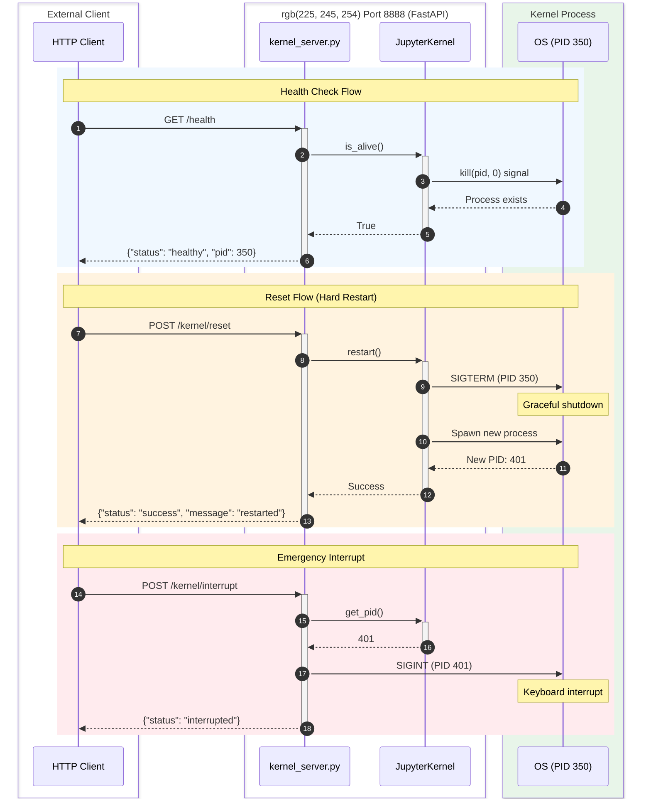

# The Kernel Server

The kernel server is a FastAPI application that provides HTTP control over the Jupyter kernel. It's the interface between the outer orchestration system and the Python execution environment.

---

## What It Does

At its core, the kernel server manages lifecycle. When the agent needs a fresh Python environment, something calls `/kernel/reset`. When runaway code needs to stop, something calls `/kernel/interrupt`. The endpoints are simple REST calls that translate to kernel operations.

The server exposes several endpoints. The health check at `/health` reports whether the kernel is alive and what its PID is. The reset endpoint at `/kernel/reset` restarts the IPython environment, wiping all variables and state. The interrupt endpoint at `/kernel/interrupt` sends SIGINT to running code, like hitting Ctrl+C. The connection endpoint at `/kernel/connection` returns the ZeroMQ connection file so clients can connect directly to the kernel. There's also a debug endpoint at `/kernel/debug` that exposes internal state for inspection.

---

## Application Lifecycle

The server uses FastAPI's lifespan context manager to initialize the kernel at startup and clean it up at shutdown.

```python
@asynccontextmanager
async def lifespan(app: FastAPI):
    # Startup: Initialize kernel
    app.state.kernel = JupyterKernel()
    yield
    # Shutdown: Cleanup
    app.state.kernel.shutdown()
```

The kernel object is stored in `app.state.kernel`, making it accessible to all endpoint handlers. This is straightforward dependency injection—the kernel is created once, shared across the application lifetime, and cleaned up when the server stops.

---

## Endpoint Implementation

The health check endpoint returns the kernel's status and PID.

```python
@app.get("/health")
async def health_check():
    kernel = app.state.kernel
    return {
        "status": "healthy" if kernel.is_alive() else "unhealthy",
        "kernel_alive": kernel.is_alive(),
        "kernel_pid": kernel.get_pid()
    }
```

The reset endpoint performs a kernel restart and returns details about the transition.

```python
@app.post("/kernel/reset")
async def reset_kernel():
    kernel = app.state.kernel
    old_pid = kernel.get_pid()

    # Perform restart
    kernel.restart()

    return {
        "status": "success",
        "message": "Kernel restarted",
        "old_pid": old_pid,
        "new_pid": kernel.get_pid(),
        "connection_file": kernel.connection_file
    }
```

The interrupt endpoint sends SIGINT to the kernel process.

```python
@app.post("/kernel/interrupt")
async def interrupt_kernel():
    kernel = app.state.kernel

    # Send SIGINT to kernel process
    pid = kernel.get_pid()
    if pid:
        os.kill(pid, signal.SIGINT)
        return {"status": "success", "message": f"Sent SIGINT to kernel (PID: {pid})"}
    else:
        return {"status": "error", "message": "Could not determine kernel PID"}
```

The connection endpoint returns the ZeroMQ connection configuration.

```python
@app.get("/kernel/connection")
async def get_connection():
    kernel = app.state.kernel

    # Read connection file
    with open(kernel.connection_file) as f:
        config = json.load(f)

    return {
        "connection_file": kernel.connection_file,
        "config": config  # Contains ZMQ endpoints
    }
```

---

## Security Posture

The server binds to `0.0.0.0:8888`, meaning it accepts connections on all network interfaces. Combined with the CORS configuration that allows all origins, this means anyone who can reach the container network can call these endpoints.

```python
app.add_middleware(
    CORSMiddleware,
    allow_origins=["*"],
    allow_credentials=True,
    allow_methods=["*"],
    allow_headers=["*"],
)
```

This is the most permissive possible CORS configuration. The assumption is that container network isolation provides the security boundary—nothing untrusted should be able to reach port 8888 in the first place.

Error handling uses FastAPI's exception handlers to wrap errors in a consistent JSON format. Both generic exceptions and validation errors get caught and formatted with status, error type, and message fields.

---

## Response Models

The server uses Pydantic for schema validation.

```python
class ApiResponse(BaseModel):
    """Generic API response wrapper"""
    status: str  # "success" or "error"
    data: Optional[Dict] = None
    error: Optional[str] = None

class KernelStatusResponse(BaseModel):
    """Kernel status information"""
    alive: bool
    pid: Optional[int]
    connection_file: str
    client_connected: bool

class ConnectionInfoResponse(BaseModel):
    """Connection configuration"""
    connection_file: str
    config: Dict  # Parsed connection JSON
```

The code is about 300 lines, small for a service with this much responsibility. It's a thin layer over the kernel management logic in `jupyter_kernel.py`.

## Server Request Flow


